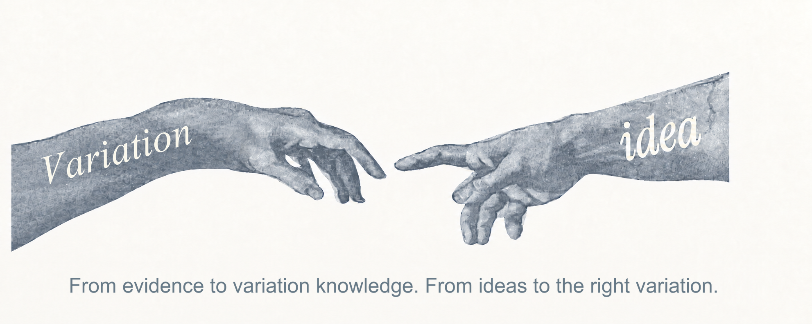
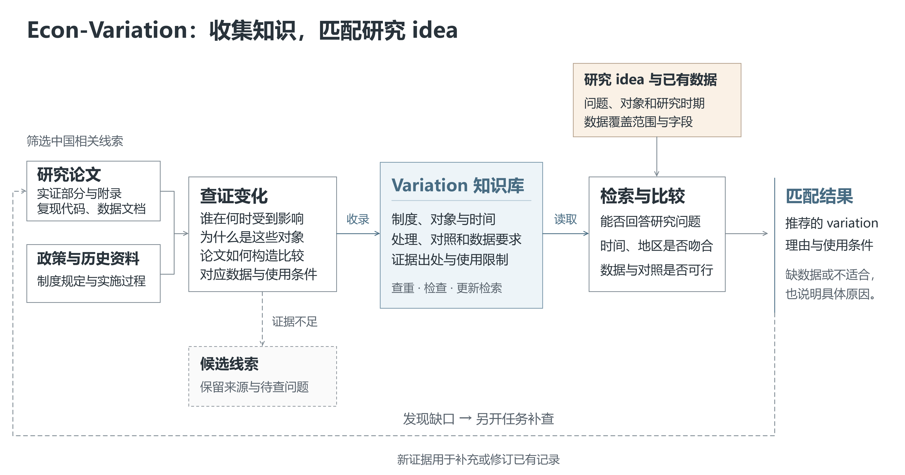
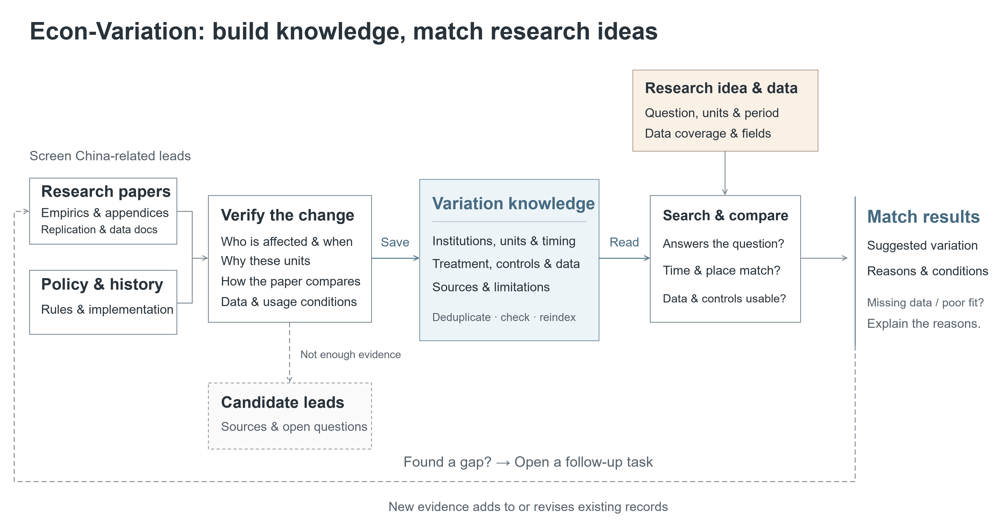

<h1 align="center">Econ-Variation</h1>

<p align="center"><a href="#简体中文">简体中文</a> · <a href="#english">English</a></p>

<h2 align="center">让你的 agent 在项目中持续积累经济学研究中的外生冲击与政策冲击，并为研究 idea 匹配最合适的 variation。</h2>

<p align="center">
  <a href="https://github.com/mimaowang/Econ-Variation/actions/workflows/validate.yml"></a>
  <a href="guides/mental-model.md"></a>
  <a href="requirements.txt"></a>
  <a href="LICENSE"></a>
</p>

<p align="center"></p>

## 简体中文

这是一个供经济学研究者和学生使用的开源知识库，帮助 agent 持续查证、积累经济学研究中的外生冲击与政策冲击，并为具体研究 idea 匹配合适的 variation。下载项目，在 Codex、Claude Code 等工具中，用你的 agent 打开项目文件夹，告诉它你想研究什么、有哪些数据，或希望积累哪个方向的知识，就能开始。

这里的 **variation，是某种变化让不同的人、企业或地区受到不同影响，从而为研究提供可比较的差异**。记录不止保存政策名称和论文链接，还解释谁受到影响、何时发生、如何构造处理与对照、需要什么数据，以及哪些条件下不能这样使用。现有积累以中国实证研究为主；目标是让下一位研究者或 agent 能据此判断，而不是重新查一遍资料。

[开始使用](#快速开始) · [浏览知识记录](variations/) · [看一个例子](#它能帮你做什么) · [与数据知识库配合](#与-econ-data-know-how-配合使用)

## 快速开始

1. 普通使用优先下载[自动检查通过后的轻量运行包](https://github.com/mimaowang/Econ-Variation/actions/workflows/validate.yml)：打开最新成功的运行，在 Artifacts 下载 `Econ-Variation-runtime`，解压其中的 ZIP。下载此附件需要登录 GitHub。开发者也可克隆完整仓库。
2. 在 Codex、Claude Code 等工具中，用你的 agent 打开项目文件夹。
3. 告诉 agent 你的研究 idea，让它匹配 variation；或指定研究方向，让它查证并积累知识。

**为研究 idea 匹配 variation：**

> 请先阅读 AGENTS.md 和 guides/mental-model.md，理解这个项目是为了帮助研究者判断某种变化能否用于自己的研究。我的 idea 是：【想研究什么、研究谁、哪些地区与年份】；已有数据是：【观测单位、年份、主要变量和可用标识；不确定的地方也可以直接说】。运行项目 doctor，从已有记录中比较最合适的 variation，解释为什么选它而不是相近的候选，谁受到影响、如何构造处理与对照、怎样连接数据，以及证据和因果解释的边界。如果缺少会改变判断的信息，请说明。附上所依据的记录链接，用中文回答；这次只匹配，不修改文件或启动收集。

**为自己的研究方向持续积累知识：**

> 我想持续积累【中国相关的研究方向】中的 variation。请阅读 AGENTS.md、guides/mental-model.md 和 guides/operations.md，理解我们要留下的是后续研究可以据此判断的知识，而不只是政策清单。运行 doctor，恢复已有任务，先补一个有价值的缺口，再从高质量论文及制度原始资料中查证。解释究竟发生了什么、影响如何分配、论文实际怎样使用、需要什么数据，以及什么会让这个设计失效。保留已有知识；尚未查清的内容留在候选层，并记录下一步。完成一个有边界的任务和项目检查后，再按这个目的继续推进，简短汇报实际完成了什么。

使用已配置好的 agent 即可，**本项目不要求额外的 API Key，也不绑定某个模型**。直接阅读知识记录不需要 Python；运行检索、匹配和维护工具需要下方的[本地配置](#使用工具与参与维护)。持续运行或定时唤醒由你使用的工具安排，仓库本身不是后台服务；运行费用也取决于你的工具和模型。

## 它能帮你做什么？

假设你问：

> 我有 2007—2019 年的中国城市年度数据，想研究数字基础设施与城市创新。有哪些政策变化值得考虑？

一个有用的回答，不应停在“可以用宽带中国做 DID”，而应继续解释：

> 可以先比较**“宽带中国”示范城市的分批认定**：2014、2015、2016 年的名单给出了不同地方首次入选的时间。但名单包含城市群、区、县级市等不同实体，不能直接把每个名称都当成一个地级市；需要先核对它们如何对应你的城市代码。
>
> 如果研究城市创新，论文中的一个具体应用是每百人授权发明专利数的增长，需要专利、人口和相应控制变量，不能因为 GDP 数据更齐全就换成研究经济增长。入选还经过申请和审核，并非随机；认定也不等于网络建设已经完成。对照组、提前准备、政策前趋势及跨城影响仍需判断。

这个例子依据库内的[宽带中国记录](variations/china-broadband-china-pilot-city-designation.md)。它提供政策名单来源、论文应用和不同结果变量的数据要求，但名单到论文城市样本的映射及部分代码细节仍未独立重建。因此，**这是值得进一步核验的候选，不是已经证明有效的因果设计**。若数据从首次认定之后才开始，也不能直接做同一个需要政策前年份的比较。

项目最希望帮你省下的，是**选了一个看似合适的冲击，做到一半才发现处理错了、数据接不上，或假设不成立的成本**：

- **从研究问题出发比较，而不只是搜到一个政策名字。** 同时考虑研究对象、结果变量、作用机制、时空范围和已有数据，解释候选之间的取舍。
- **把制度变化接到可编码的处理与对照。** 写清实际分配规则、时间、地理边界和连接标识，而不只写一个“DID”或“IV”标签。
- **把查证成果留给下一次研究。** 来源、论文用法、数据要求和未解决的问题随记录保存，不依附于某次对话。

## 目前有哪些内容？

现有记录以中国相关研究为主，涵盖区域与城市、发展、企业与创新、基础设施、贸易、公共政策等方向，也保留其他领域的历史积累。截至 **2026 年 10 月 7 日，共有 185 条知识记录，其中 142 条可进入匹配比较（10 条直接候选、132 条条件候选）**；这不是 142 个已经验证、可以直接套用的因果设计。

下面五条记录展示重要研究主题中需要认真查证的变化。难点不只是找到政策名称，而是把历史资料、实施规则和论文用法接起来，让下一次研究不必从头整理：

| 知识记录 | 可以先判断什么 | 容易忽略的条件 |
|---|---|---|
| [三线建设：工业积累与早期铁路可达性](variations/china-third-front-industrial-capacity-early-rail-access.md) | 历史工业布局与内陆地区长期发展、企业进入和产业集聚 | 历史工厂、人口与铁路网络要对应到统一地理边界；工业遗产不是纯三线工厂名单，早期铁路工具变量仍需排除限制 |
| [撤县设区与市县整合（2011—2018 年应用）](variations/china-city-county-merger-consolidation.md) | 行政区划调整与城市扩张、市场整合及企业和劳动市场变化 | 批复、实施和论文年度编码可能不是同一个时点；区划转换与辖区整合不能混为一个处理，选择性改革和提前反应需要判断 |
| [WTO 入世时期的行业关税调整](variations/china-wto-accession-firm-performance.md) | 贸易开放与企业生产率、加成及投入成本 | 区分产出关税与投入关税、承诺上限与实际税率；产品到行业的映射、投入产出权重和分类变更决定企业暴露，不能只用入世后虚拟变量 |
| [2002 年所得税分享改革与县级财政依赖](variations/china-2002-income-tax-sharing-county-dependence.md) | 全国改革下，不同财政结构的县如何受到不同影响 | 需要可比的改革前财政口径和县级标识；省以下分成与基数保护影响实际暴露，不能假定各县统一损失一半收入 |
| [八七扶贫计划的国家级贫困县资格门槛](variations/china-8-7-poverty-county-threshold.md) | 扶贫资格与县域发展，门槛附近能否形成可信比较 | 1992 年收入、历史资格和 1994 年名单需要连接；400 元准入与 700 元退出规则不同，实际资格不是收入机械决定的清晰断点 |

从[知识记录目录](variations/)查看具体内容，从[带日期的健康快照](dist/health.json)查看当前数量和成熟度。**总记录数不等于可直接开展研究的数量**；部分记录仍是待审计线索，默认检索不会把它们当作推荐。项目也不声称已经覆盖所有中国研究或所有政策。

[收集地图](sources/fieldtop-china-regional-urban-coverage.md)记录当前收集方向和期刊范围。高质量期刊帮助发现有价值的材料，不替代证据核验；当前作者的收集重点，也不要求每位用户重复同一轮收集或删除范围外的已有知识。

## 为什么适合 agent 使用和持续积累？

<p align="center"><a href="assets/econ-variation-workflow-zh.png"></a></p>

论文和政策资料提供线索与证据；查清影响对象、时间和比较方式后，保存为可复用的知识。匹配时再结合你的研究问题与已有数据，判断哪些 variation 合适。点击图片可放大查看。

这里的“AI 原生”，指 agent 既能使用知识，也能查证、补充和维护知识。文字说明保存制度含义与判断理由，结构化字段帮助检索和比较；两者描述同一件事，而不是让自然语言迁就一套僵硬格式。一条正式记录围绕一个具体变化及其主要分配机制；同一变化用于不同研究时，各自的数据要求分开保存，避免把所有可能用到的变量都变成必需项。

[AGENTS.md](AGENTS.md) 是入口，[理解项目的指南](guides/mental-model.md)解释为什么要这样推理，而不只告诉 agent 填哪些字段。维护时，任务、候选和来源记录帮助新的 agent 或上下文压缩后的 agent 接续工作：先找回正在解决的问题，再补一个明确缺口。发现的线索先留下，核心证据查清后才进入正式知识；遇到无法访问或相互冲突的材料，也能保留原因，而不是靠猜测把记录写完。

知识与工具都保存在可阅读的本地文件中，不捆绑原始数据或模型，也不需要部署数据库服务。你可以复制、查看修改，或换一个 agent 继续使用。检查工具帮助发现结构和流程问题，但不能代替研究判断，也不保证每一种模型都能无需监督地长期运行。

## 如何理解推荐与证据边界？

**没有哪个政策天然就是“外生冲击”。** 能否用于因果研究，取决于你研究什么、谁受到影响、如何选择、拿谁作比较，以及关键假设是否可信。来源会区分已经核实的事实、论文报告的做法和分析推断；标题、摘要或政策公告，不能替代论文实证部分或实际实施证据。

中国境内的变化记为 `china-variation`；直接改变中国单位所受影响的全球变化记为 `global-china-variation`；国外论文的可借鉴方法记为 `transferable-method`。最后一类是方法启发，不会被推荐成发生在中国的政策冲击。

`grounded` 表示核心制度与时间已有依据、研究应用可追溯；`design-documented` 进一步记录分配、设计和数据条件。它们是知识成熟度，不是因果有效性的认证。已有 `extracted` 记录仍是待核验线索，不是新记录的交付标准；`contested` 保留争议，`deprecated` 指向替代记录。[维护流程](guides/operations.md)解释具体判断。

实际推荐可以是“条件满足时可用”，也可以是“不兼容”或“目前有知识缺口”。明确说出限制，比勉强凑出一个推荐更有价值。

## 与 Econ Data Know-How 配合使用

[Econ Data Know-How（Econ-DataKnowhow）](https://github.com/mimaowang/Econ-DataKnowhow)是同一作者维护的互补项目。**Econ-Variation 帮你判断用什么变化开展研究；Econ Data Know-How 帮你判断用什么数据、为什么选它，以及怎样获取或构建。** 后者积累的是数据知识与使用指南，不是原始数据文件仓库。

例如，选中城市政策后，这里说明需要哪些年份、结果变量和地理标识；数据知识库帮助查找能满足这些要求的数据、申请或下载入口、构建步骤和连接限制。agent 再对照研究对象、观测单位、地区、年份、频率、字段、访问条件与标识，判断两边是否真正接得上；必要时用论文 DOI 查找同一研究的数据路径。

两个项目各司其职，**可以独立使用，不要求同时安装**。它们没有自动导入或固定的一对一绑定，也不重复维护彼此的知识记录；搭配使用时由 agent 根据当前研究需要进行比较，而不是仅凭同一个论文标题就认定兼容。

## 使用工具与参与维护

运行工具需要 Python 3.10+。在解压后的项目根目录用一条命令完成配置：

```powershell
python scripts/setup.py
```

这会创建 `.venv`，只安装两个运行依赖，再运行只读 doctor 检查；不安装测试、benchmark、代码风格工具或模型。后续命令使用该环境的 Python：Windows 可用 `.\.venv\Scripts\Activate.ps1` 激活，macOS/Linux 用 `source .venv/bin/activate`；也可直接调用其中的 Python，无需更改 PowerShell 执行策略。doctor 用于发现记录无效、生成索引过期或任务未结束等具体问题。若你的工具不会自动加载 `AGENTS.md`，像上面的提示词一样明确请 agent 阅读即可。

如果已克隆完整 Git 仓库，可用 `python scripts/setup.py --destination ../Econ-Variation-runtime` 一次导出并配置纯运行目录，再让 agent 打开新目录。目标必须是新建或空目录，已有文件不会被覆盖。运行包保留全部知识、来源与任务接续记录，但不包含测试、benchmark、开发配置和历史设计文档；日常使用与收集不需要 Git。完整源码仍保留开发材料。

<details>
<summary>展开：命令行检索与匹配示例</summary>

按中国变化和研究主题检索；主题支持中英文别名：

```powershell
python scripts/search.py --role china-variation --topic firms-innovation --text innovation --limit 3
python scripts/search.py --role china-variation --topic 城市 --text broadband --limit 3
```

把下面示例保存为 `query.yaml`，按实际拥有的数据修改；不要把尚未取得的字段写成已有：

```yaml
filters:
  roles: [china-variation]
  text: [Broadband China]
limit: 3
intent:
  outcome: Innovation
design_profile_ids:
  china-broadband-china-pilot-city-designation: city-innovation
data:
  observation_unit: City-year
  geography: City
  time_start: 2007
  time_end: 2019
  frequency: annual
  identifiers: [stable city code, year]
  available_fields: [city identifier, year, granted invention patents, resident population]
comparison:
  untreated_available: true
```

```powershell
python scripts/match.py --query query.yaml
```

这个示例有创新结果数据，但还没有列出政策批次、名单映射及控制变量；匹配器应暴露这些缺口，而不是换成一个数据更齐全的 GDP 研究。`intent.outcome` 保留研究目的，`intent.design` 可选，`design_profile_ids` 可指定同一变化的具体应用。agent 需要忠实地把问题对应到记录词汇，并阅读正式记录判断含义；这不是语义模型自动完成的研究判断。

结果为 `compatible`、`conditional`、`incompatible`、`method-only` 或 `gap`，附各维度理由。工具在限定范围内比较研究目的与数据适配，再截取候选；不等于穷尽所有变化或证明排第一的设计最好。未指定目的时，应用选择仅是 `data-fit-exploration`，不能冒充研究推荐。自由文本中的对象、单位与地区仍需人工或 agent 核对；平行趋势、排除限制和机制不由程序认证。

检索默认排除未成熟线索；`--include-leads` 仅供查看待审计内容。关键词相似不意味着数据兼容或因果有效。

</details>

想补充知识或参与维护，先理解项目目的，再按[收集流程](guides/operations.md#collection-loop)完成一个明确任务。筛选只保留候选、跳过或受阻的理由；候选另经身份解析和证据核验，才进入正式记录。这样下一位 agent 能接着解决问题，不必接手被包装成成品的半成品。

日常知识收集与维护只需要上述运行配置。任务完成时检查记录结构、证据准入、任务状态和生成索引；代码回归测试、benchmark 与风格检查由完整源码的 GitHub CI 执行。benchmark 是检索与匹配的固定测试案例，不是使用知识库的前提，也不是模型理解能力的认证。

只有修改程序或开发测试时，才在完整源码中安装开发依赖：

```sh
python -m pip install -r requirements-dev.txt
```

随后遵循[贡献与验证说明](https://github.com/mimaowang/Econ-Variation/blob/main/CONTRIBUTING.md#verification-and-release)。索引和健康快照由记录及任务状态生成，不需要手工维护另一份知识。软件检查通过说明结构与行为一致，不证明每条研究陈述都正确或每个 agent 的表现都相同。

## 项目导览与许可

| 入口 | 内容 |
|---|---|
| [AGENTS.md](AGENTS.md) → [理解项目](guides/mental-model.md) | 新 agent 应先理解的目的与推理方式 |
| [variations/](variations/) | 正式知识记录、证据、使用边界与模板 |
| [检索](scripts/search.py) → [匹配](scripts/match.py) | 找到候选，检查研究目的与数据条件 |
| [维护流程](guides/operations.md) → [state/](state/) | 任务、候选、运行记录与接续状态 |
| [sources/](sources/) → [schema/](schema/) | 来源范围、记录结构及双语主题词汇 |
| [dist/health.json](dist/health.json) | 当前知识与任务的质量快照 |

代码与原创仓库内容采用 [Apache 2.0](LICENSE)。链接的论文、政府文件和第三方数据保留各自权利；不要提交 API Key、受限数据、受版权保护的论文全文、个人数据或敏感链接。贡献与问题报告见[完整源码的贡献说明](https://github.com/mimaowang/Econ-Variation/blob/main/CONTRIBUTING.md)和 [SECURITY.md](SECURITY.md)。

## English

<h2 align="center">Let your agent continually build knowledge of exogenous and policy shocks in economics within this project, and match your research idea to the most suitable variation.</h2>

<p align="center">
  <a href="https://github.com/mimaowang/Econ-Variation/actions/workflows/validate.yml"></a>
  <a href="guides/mental-model.md"></a>
  <a href="requirements.txt"></a>
  <a href="LICENSE"></a>
</p>

<p align="center"></p>

Econ-Variation is an open knowledge base for economics researchers and students. Your agent can verify and accumulate knowledge of exogenous and policy shocks used in economics research, then compare which variations fit a specific research idea. Download the repository, open its folder in Codex, Claude Code or another coding agent, and describe your question and available data—or the research area you want to build knowledge about.

A **variation is a change that affects people, firms or places differently, creating a comparison for research**. Records preserve more than policy names and paper links: who is exposed, when, how treatment and comparison are constructed, what data are needed, and when the design may fail. The existing collection focuses on China. Its purpose is to make the reasoning reusable by the next researcher or agent, without repeating the original search.

[Get started](#quick-start) · [Browse records](variations/) · [See an example](#what-can-it-help-you-do) · [Use the companion data project](#using-econ-data-know-how-together)

## Quick start

1. For ordinary use, download the [CI-checked lightweight runtime](https://github.com/mimaowang/Econ-Variation/actions/workflows/validate.yml): open the latest successful run, download `Econ-Variation-runtime` under Artifacts (GitHub sign-in required), and extract the ZIP inside. Developers may clone the full repository.
2. Open its folder in your coding agent.
3. Describe a research idea to match variations, or a research area to verify and accumulate knowledge about.

**Match a research idea:**

> Read AGENTS.md and guides/mental-model.md to understand that the project helps researchers judge whether a variation fits their question. My idea is **[question, population, places and years]**. My available data are **[unit, years, fields and identifiers; include anything still uncertain]**. Run the repository doctor, compare suitable variations in the existing collection, and explain why you prefer them to close alternatives. Explain exposure, treatment, comparison, data connections, evidence limits and identifying assumptions. Ask about missing information that would change the conclusion, and cite the records used. Answer in my language without editing files or starting collection.

**Build knowledge for your research area:**

> I want to keep building variation knowledge for **[China-related research area]**. Read AGENTS.md, guides/mental-model.md and guides/operations.md. Understand that we preserve knowledge for future research decisions, not just a policy list. Run the doctor, recover existing tasks and close one valuable gap before expanding. Verify high-quality papers and primary institutional sources; explain what changed, how exposure was assigned, how the paper actually used it, what data are required and how the design could fail. Preserve existing knowledge and keep unresolved findings as candidates with a next step. Complete a bounded task and the project checks, then continue toward the same purpose. Report briefly what was actually completed.

Use your already-configured agent: **the repository requires no additional API key and no particular model**. Reading records requires no Python installation; the search, matching and maintenance tools need the [setup below](#tools-and-maintenance). Continuous runs and scheduled wakeups belong to your runtime, not a background service supplied by this repository. Agent costs depend on your tool and model.

## What can it help you do?

Suppose you ask:

> I have annual Chinese city data for 2007–2019 and want to study digital infrastructure and city innovation. Which policy changes should I consider?

A useful answer should go beyond “use Broadband China with DID”:

> **Broadband China demonstration designations** offer first-entry cohorts in 2014, 2015 and 2016. But the official lists include city clusters, districts and county-level cities; each named entity cannot simply become one prefecture-city treatment. Audit the mapping to your city identifiers first.
>
> One documented innovation application studies growth in granted invention patents per 100 residents, requiring patents, population and the relevant controls. More complete GDP data do not justify silently changing the research question. Designation followed applications and review, not random assignment; it is also not proof that network construction was complete. Comparison units, anticipation, pre-trends and cross-city effects still need judgment.

This illustration uses the [Broadband China record](variations/china-broadband-china-pilot-city-designation.md). It retains official-list sources, paper applications and separate outcome requirements, but the paper's city crosswalk and some code details have not been independently reconstructed. **It is a candidate to investigate, not a certified causal design.** A panel beginning after first designation cannot support the same comparison requiring pre-treatment observations.

The project aims to reduce the cost of selecting a promising shock and later discovering that treatment was misclassified, data cannot be joined or the assumptions fail:

- **Compare from the question, not just keywords.** Consider population, outcome, mechanism, time, place and available data, with reasons for choosing among alternatives.
- **Connect institutions to encodable treatment and comparison.** Preserve assignment, timing, boundaries and identifiers rather than only a DID or IV label.
- **Keep verification useful beyond one conversation.** Sources, paper uses, requirements and unresolved questions remain with the record.

## What is in the collection?

China-related records cover regional and urban economics, development, firms and innovation, infrastructure, trade and public policy, alongside historical work in other fields. As of **October 7, 2026, the collection contains 185 knowledge records, including 142 eligible for matching and comparison (10 direct candidates and 132 conditional candidates)**. These are not 142 validated, ready-to-estimate causal designs.

The five records below illustrate important research topics where the hard work goes beyond finding a policy name: connecting historical sources, implementation rules and actual paper applications so the next study does not have to start from scratch.

| Record | What you can assess | Conditions that matter |
|---|---|---|
| [Third Front industrial capacity and early railway access](variations/china-third-front-industrial-capacity-early-rail-access.md) | Historical industrial placement, long-run inland development, firm entry and agglomeration | Match historical plants, population and railway networks to consistent geography; industrial legacy is not an exclusive Third Front plant roster, and the early-rail instrument still needs an exclusion restriction |
| [County-to-district reform and city–county consolidation: the 2011–2018 application](variations/china-city-county-merger-consolidation.md) | Administrative changes, urban expansion, market integration, firms and labor markets | Approval, implementation and annual paper coding may use different clocks; district conversion and jurisdictional consolidation are not interchangeable treatments, and selection and anticipation need assessment |
| [WTO-accession-era industry tariff changes](variations/china-wto-accession-firm-performance.md) | Trade liberalization, firm productivity, markups and input costs | Separate output from input tariffs and negotiated ceilings from actual rates; product–industry mappings, input–output weights and classification changes determine firm exposure, not a simple post-accession dummy |
| [2002 income-tax sharing and county fiscal dependence](variations/china-2002-income-tax-sharing-county-dependence.md) | How a nationwide reform affects counties with different fiscal structures | Comparable pre-reform fiscal categories and county identifiers are essential; subprovincial sharing and protected revenue bases affect exposure, rather than a uniform 50% county revenue loss |
| [National poverty-county eligibility under the 8-7 Plan](variations/china-8-7-poverty-county-threshold.md) | Poverty-program eligibility, county development and credible near-cutoff comparisons | Join 1992 income, historical designation and the 1994 roster; the 400-yuan entry and 700-yuan exit rules differ, and actual designation does not follow a mechanically sharp income cutoff |

Browse [variations/](variations/) and the dated [health snapshot](dist/health.json) for current content and maturity. **Total records are not a count of ready-to-estimate designs.** Some remain audit leads and are excluded from default recommendations. The collection does not claim exhaustive coverage of China research or policies.

The [collection map](sources/fieldtop-china-regional-urban-coverage.md) records current priorities and journal scope. Publication quality helps discovery, not evidence certification. The author's campaign does not require every user to repeat it or remove existing knowledge outside its focus.

## Why is it suited to agents and continued accumulation?

<p align="center"><a href="assets/econ-variation-workflow-en.png"></a></p>

Papers and institutional sources provide leads and evidence. Once exposure, timing and comparison are established, the findings become reusable knowledge. Matching then considers your research question and available data to judge which variations fit. Click to enlarge.

AI-native means agents can both use and maintain the knowledge. Connected prose preserves institutional meaning and judgment; structured fields make that same knowledge searchable and comparable. A canonical record follows one specific change and its primary assignment mechanism. Distinct research applications keep separate requirements instead of turning every possible variable into a universal prerequisite.

[AGENTS.md](AGENTS.md) is the entry point, and the [project guide](guides/mental-model.md) explains why the reasoning matters. Tasks, candidates and source notes let a fresh agent—or one recovering after context compaction—resume the actual decision gap. Discovery retains leads; core evidence is resolved before publication. Inaccessible or conflicting evidence leaves a reason and next step, not a confidently completed guess.

Readable local files hold the knowledge and tools, without bundled datasets, models or a database service. You can copy the project, inspect changes and switch agents. Checks help detect structural and workflow failures; they do not replace research judgment or guarantee unattended performance from every model.

## Recommendation and evidence limits

**No policy is intrinsically exogenous.** Causal usefulness depends on the question, exposure, selection, comparison and assumptions. Records distinguish verified facts, source-reported applications and analytical inference. Titles, abstracts and policy announcements cannot substitute for empirical sections or implementation evidence.

`china-variation` covers changes in China or exposure assigned to Chinese units. `global-china-variation` covers global changes directly affecting Chinese units. `transferable-method` preserves reusable constructions from overseas studies—not a foreign policy presented as a Chinese shock.

`grounded` records have supported institutional identity and timing with traceable applications; `design-documented` records further document assignment, design and data conditions. These are knowledge-maturity states, not causal-validity certificates. Existing `extracted` records remain audit leads, not the admission standard for new records. `contested` preserves material disputes; `deprecated` redirects to replacements. See the [operations guide](guides/operations.md).

A useful answer may be conditional, incompatible or a knowledge gap. An explicit limitation is better than a forced recommendation.

## Using Econ Data Know-How together

[Econ Data Know-How (Econ-DataKnowhow)](https://github.com/mimaowang/Econ-DataKnowhow) is a complementary project by the same author. **Econ-Variation explains which change could support a study; Econ Data Know-How explains which data to choose, why, and how to obtain or construct them.** The companion stores data knowledge and practical guidance, not the underlying datasets.

After selecting a city policy, this project specifies the necessary years, outcomes and geographic identifiers. The data project helps locate suitable assets, acquisition or construction steps and joining limits. Your agent compares population, unit, geography, time, frequency, fields, access and identifiers to establish whether they actually connect, using a paper DOI to find a related data route when helpful.

The projects **work independently and do not require joint installation**. Neither automatically imports the other or maintains a fixed one-to-one binding or duplicate catalog. Compatibility is assessed for the current question, not assumed from a shared paper title.

## Tools and maintenance

Tools require Python 3.10+. Configure an extracted runtime folder with one command:

```powershell
python scripts/setup.py
```

This creates `.venv`, installs only the two runtime dependencies and runs the read-only doctor. It installs no tests, benchmark tools, linters or models. Use that environment for subsequent commands: activate with `.\.venv\Scripts\Activate.ps1` on Windows or `source .venv/bin/activate` on macOS/Linux, or call its Python directly without changing PowerShell execution policy. Doctor identifies invalid records, stale generated views or unfinished tasks. If your agent does not load `AGENTS.md` automatically, name it explicitly in your prompt.

From a full Git checkout, `python scripts/setup.py --destination ../Econ-Variation-runtime` exports and configures a fresh runtime-only folder in one command. Existing populated destinations are not overwritten. All knowledge, sources and recovery state remain; tests, benchmarks, developer configuration and historical design documents do not. Daily use and collection require no Git. Developers keep the full source checkout.

<details>
<summary>Command-line search and matching examples</summary>

Search China variations by topic; English and Chinese aliases are supported:

```powershell
python scripts/search.py --role china-variation --topic firms-innovation --text innovation --limit 3
python scripts/search.py --role china-variation --topic 城市 --text broadband --limit 3
```

Save this illustration as `query.yaml`, replacing the data description with what you actually have:

```yaml
filters:
  roles: [china-variation]
  text: [Broadband China]
limit: 3
intent:
  outcome: Innovation
design_profile_ids:
  china-broadband-china-pilot-city-designation: city-innovation
data:
  observation_unit: City-year
  geography: City
  time_start: 2007
  time_end: 2019
  frequency: annual
  identifiers: [stable city code, year]
  available_fields: [city identifier, year, granted invention patents, resident population]
comparison:
  untreated_available: true
```

```powershell
python scripts/match.py --query query.yaml
```

The example supplies innovation outcomes but omits cohort assignment, crosswalk and control fields. The matcher should expose those gaps, not switch to a GDP application. `intent.outcome` preserves the purpose; `intent.design` is optional, and `design_profile_ids` selects a particular application. Map terms faithfully to record vocabulary and inspect their substantive meaning: this is not a semantic model making research judgments.

Results are `compatible`, `conditional`, `incompatible`, `method-only` or `gap`, with dimension-level reasons. The tool compares intent and joint data fit within the filtered collection before limiting the shortlist; it does not exhaust every variation or certify the first design as best. Without intent, profile selection is `data-fit-exploration`, not a recommendation. Free-text population, unit and geography still need review. Parallel trends, exclusion restrictions and mechanisms are not programmatically certified.

Default search excludes immature leads. `--include-leads` is for audit exploration; a keyword match proves neither data compatibility nor causal validity.

</details>

For contributions, understand the purpose and complete a bounded task through the [collection workflow](guides/operations.md#collection-loop). Screening retains a candidate or a skip/block reason. A separate task resolves identity and evidence before canonical publication, so the next agent inherits an explicit problem rather than a half-finished record disguised as a product.

Daily knowledge maintenance needs only the runtime setup. Task completion validates records, evidence admission, task state and generated views; GitHub CI runs code regressions, benchmarks and lint in the full source. Benchmarks are fixed retrieval/matching test cases, not a prerequisite for use or a certificate of model understanding.

Only when changing code or developing tests, install development dependencies in the full source:

```sh
python -m pip install -r requirements-dev.txt
```

Then follow [contribution and verification instructions](https://github.com/mimaowang/Econ-Variation/blob/main/CONTRIBUTING.md#verification-and-release). Indexes and health snapshots are generated from records and durable state, not maintained as a second knowledge base. Passing tests establishes consistency, not the truth of every claim or the performance of every agent.

## Repository guide and license

| Entry point | What it gives you |
|---|---|
| [AGENTS.md](AGENTS.md) → [Understand the project](guides/mental-model.md) | Purpose and reasoning a new agent should understand |
| [variations/](variations/) | Canonical knowledge, evidence, limits and writing template |
| [Search](scripts/search.py) → [match](scripts/match.py) | Candidate recall and intent/data-fit checks |
| [Operations](guides/operations.md) → [state/](state/) | Tasks, candidates, runs and durable recovery state |
| [sources/](sources/) → [schema/](schema/) | Source boundaries, record structure and bilingual topics |
| [dist/health.json](dist/health.json) | Current knowledge and task quality snapshot |

Code and original repository content are licensed under [Apache 2.0](LICENSE). Linked papers, government documents and third-party data retain their own rights. Do not contribute credentials, restricted datasets, copyrighted full-text papers, personal data or sensitive URLs. See [contribution instructions in the full source](https://github.com/mimaowang/Econ-Variation/blob/main/CONTRIBUTING.md) and [SECURITY.md](SECURITY.md).
